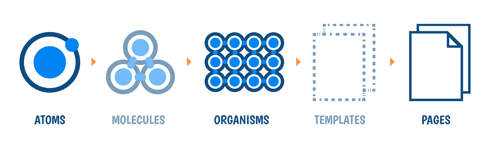

# Structuring an app is like building a house 🏡, many decisions 🤯  many views, many perspectives 🧐

Folder structure also plays a vital role. The mind is flooded with questions like where this folder/file should reside? Which place it should go to? What should be the name of the folder, file, component, hook or context 🤔

> 💻 &nbsp;&nbsp;It's the developer way of life

I normally choose the [create-react-app](https://reactjs.org/docs/create-a-new-react-app.html#create-react-app) to create a react app as it's easy to kick-start development in no time & all the tools 🛠  like basic css file, build scripts, basic testing framework & PWA are included by default.

## Starting with package.json

## package.json

```json
{
  "name": "app-name",
  "version": "0.0.1",
  "dependencies": { },
	"devDependencies": { }
  "scripts": {
    "start": "react-scripts start",
	"build": "react-scripts build",
	"test": "react-scripts test",
    "eject": "react-scripts eject",
    "stylelint": "stylelint src/**/index.css",
    "stylelint:fix": "stylelint src/**/index.css --fix",		
	"📦": "bundlesize",
	"prettification": "prettier --write \"**/*.js\""
  },
	"lint-staged": {
    "*.{js,jsx}": [
      "npm run prettification",
      "git add"
    ]
  },
	"husky": {
    "hooks": {
      "pre-commit": [
        "lint-staged"
      ]
    }
  }
}
```

## scripts

Here is where all the magic 🎩  lies, all the good things happen here

- build the app
- style the app
- test the app
- prettify the app 🥳
- lint the app 😖
- and many more

### Some tips for `scripts` in pacakge.json ✅

The script name should be easy to remember and small, Avoid using large names like `build:then:check:what:happened`

```json
"scripts": {
	"build:then:check:what:happened": "react-scripts build",
	"are:we:building:then:check:what:happened": "react-scripts build"
}
```

My choice: using emoji 😉 &nbsp;as a script name. Let me know if you're favorite emoji for building or deploying the code, for me for building the app is 🥳 &nbsp;and for deploying the app is 🚀

When I use Tailwind CSS, I tend to name the script as `build:style`, so it's easy to identify that it's a style related task, you can also name it to be specific to the framework/library like `build:tailwind` if you're using multiple styling frameworks.

```json
"scripts": {
	"build:style": "tailwind build index.css -o app.css"
}
```

Use `:` instead of `-` for script name, this will make the script name neat & crisp and also readable 👍 &nbsp;The `-` is for package names & `:` is for script names 😉

### Other stuff in `scripts`

Linting, Prettifying, Testing your app & Checking the bundle size is part & parcel of app development. To avoid code formatting issues, I have enabled the pre-commit hook with the leverage of prettier. I use `eslint` for linting JS, JSX and I use `stylelint` for linting the styles and `prettier` to format the code and to keep a tab on the bundle size, I use `bundlesize`.

Code splitting using React Lazy, Suspense & React Router 😇

## Folder structure

I follow the Atomic Design Methodology, I follow `Atoms` strictly and then bring them together in `Organisms`, then directly to `Pages`. Following the Atomic Design methodology will help you in many things while developing the project.

- Less repeated code in components, this reduces the inconsistency between the components
- The time to build an Organism or a Page will be faster 🚀
- The style guide for the project will reside in `theme.js`, The color palette, spacing, font families, font sizes, line heights, margin, padding, flex, grid and many more



### Atoms

Atoms are the smallest components, like Buttons, Heading, Input, Dropdown, Icon, Tags. This plays an important role in any app. The whole state of the app mainly starts from here.

### Organisms

Organisms are a combination of Atoms like Header, Card, Search Box with Icon, List Item,  and many more. Once you spend planning, designing the `Atoms`. The amount you spend on Organisms will be lesser. 

### Pages

Pages can be a combination of Atoms & Organisms or only Organisms, which depends on the UX design. For ex: It can be many cards with a header having a search box and some buttons.

If the components are designed in the above methodology, the time taken to build a Component will be lesser.

The main take in this is that it's not a one time process where all the small components [Atoms] are built at one go, the design of the components will get better in time ⏰, with multiple iterations & discussions

### The detailed folder structure of the components [Here I'm using Context API for shared state]

```markdown
📦 src
 ┣ 📂 components
 ┃ ┣ 📂 atoms
 ┃ ┃ ┣ Heading.js
 ┃ ┃ ┣ Input.js
 ┃ ┃ ┣ Icon.js
 ┃ ┃ ┣ Tag.js
 ┃ ┃ ┗ TextArea.js
 ┃ ┣ 📂 organisms
 ┃ ┃ ┣ Card.js
 ┃ ┃ ┣ Search.js
 ┃ ┃ ┣ Upload.js
 ┃ ┣ 📂 hooks
 ┃ ┃ ┣ useIntersectionObserver.js
 ┃ ┃ ┗ useKeyPress.js
 ┃ ┣ 📂 logics
 ┃ ┃ ┣ useName.js
 ┃ ┃ ┗ useStatus.js
 ┃ ┣ 📂 pages
 ┃ ┃ ┣ 📂 Create
 ┃ ┃ ┃ ┗ index.js
 ┃ ┃ ┣ 📂 List
 ┃ ┃ ┃ ┗ index.js
 ┃ ┃ ┣ 📂 Onboarding
 ┃ ┃ ┃ ┗ index.js
 ┃ ┃ ┗ index.js
 ┣ 📂 context
 ┣ 📂 images
 ┣ 📂 styled-elements
 ┣ 📂 tests
 ┣ 📂 utils
 ┣ App.js
 ┣ constants.js
 ┣ index.js
 ┣ serviceWorker.js
 ┣ setupTests.js
 ┗ theme.js
```

## How I structure React component

Handle the UI code in one component and separate the logic of that component in other places. This will make the component feel lightweight 🐥 and you can code better

### UI 👇

```jsx
// File Name: ../pages/Create/index.js

import React from 'react';
import { useName } from '../logics/useName';

const Create = () => {
	const { name, setName } = useName();

	const onChange = e => {
		setName(e.target.value);
	};

	return (
		<div>
			<span>{name}</span>
			<input onChange={e => onChange(e)} value={name} />
		</div>
	);
};

export { Create };
```

### Logic 👇

```jsx
// File Name: ../logics/useName.js

import React, { useState } from 'react';

const useName = () => {
	const [name, setValue] = useState('');

	const setName = name => {
		setValue(name);
	};

	return { name, setName };
};

export { useName };
```

## Styling

Normally I shuffle between [Tailwind CSS](https://tailwindcss.com/) or < 💅> [styled-components](https://styled-components.com/) based on the project requirements.

### Tailwind CSS

If I choose Tailwind CSS I tend to choose only the needed options in `tailwind.config.js` and name the npm script as `build:style` to build the styles. Naming the script `build:style` will help in identifying that it's a build method for styling purpose 😃 as I mentioned earlier.

### < 💅> styled-components

### theme.js

```json
export const theme = {
	breakpoints: [32, 48, 64],
	space: [0, 4, 8, 16, 24, 32, 48, 64, 128, 256, 512],
	fontSizes: [12, 14, 16, 18, 20, 24, 36, 48, 80, 96],
	fontWeights: [100, 200, 300, 400, 500, 600, 700, 800, 900],
	lineHeights: {
		normal: 1,
		title: 1.25,
		paragraph: 1.5
	},
	letterSpacings: {
		normal: 'normal'
	},
	colors: {
		black: '#000',
		white: '#fff',
		transparent: 'transparent',
		background: '',
		blue: '',
		lightblue: '',
		lighterblue: '',
		lightestblue: '',
		gray: '',
		darkgray: '',
		red: ''
	},
	radii: ['0px', '2px', '4px', '8px', '16px', '48px']
	// ... and many things
};
```

## Hosting

I choose [Netlify](https://www.netlify.com/) to host all the apps, Netlify is easy and also makes things easy 🚀

## References

- [https://bradfrost.com/blog/post/atomic-web-design](https://bradfrost.com/blog/post/atomic-web-design/)
- [Tailwind CSS](https://tailwindcss.com/)
- [< 💅> styled-components](https://styled-components.com/)
- [Component Based Design System With Styled-System](https://varun.ca/styled-system/) by [Varun Vachhar](https://varun.ca/)