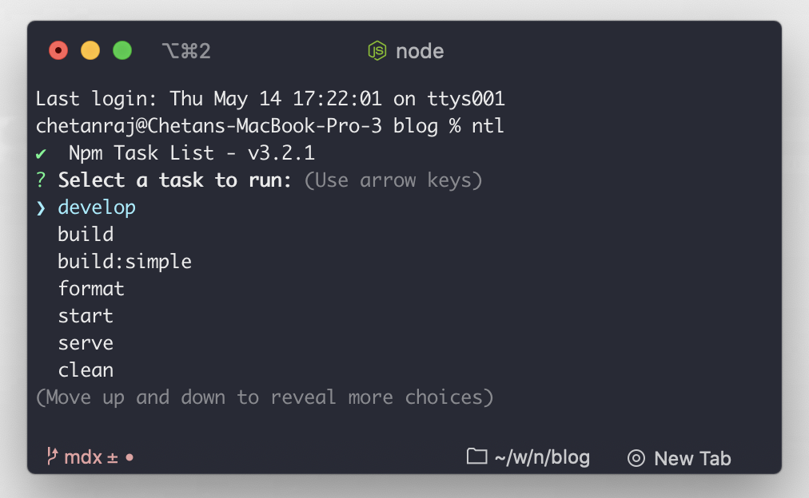

### How to install

```bash:small=bash
  $ npm install -g ntl
```

### Usage

cd into a folder containing `package.json` or you can point the project folder containing a `package.json` file and then enter the command

```js live=true
ntl;
```

When specifying a project folder, the `ntl` command takes an additional path parameter

```bash
ntl /path-to-your/blog/
```

### Output



### Features are
