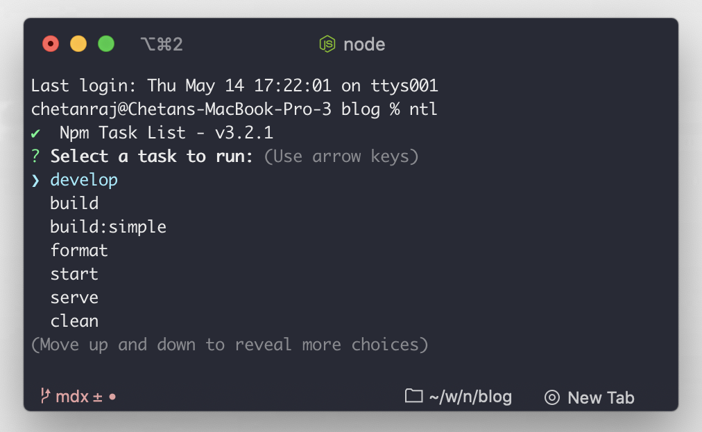

## 1. npkill

It will list all the `node_modules` in your system and the space it occupies and you can select and delete them 😇

### How to install

```bash
  $ npm install -g ntl
```

## 2. ntl

Interactive interface that lists all package.json scripts, you can select any item in the list and execute the task, You can also run multiple tasks at once 😍

### How to install

```bash
  $ npm install -g ntl
```

### Usage

cd into a folder containing `package.json` or you can point the project folder containing a `package.json` file and then enter the below command 👇🏻

```js
ntl
```

When specifying a project folder, the `ntl` command takes an additional path parameter

```bash
ntl /path-to-your/blog/
```

### Output



### To run multiple tasks

```bash
ntl -m
```


## 3. npm outdated